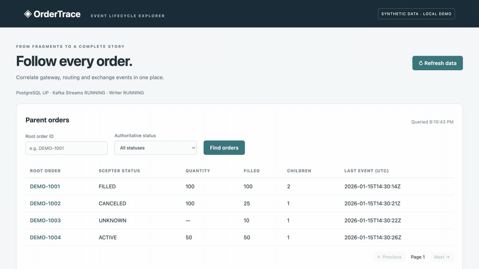

# OrderTrace

- In PROD, every service is telling only part of an order’s story. 
- OrderTrace brings those scattered events into one complete lifecycle view for downstream review.

## Why I built this

In a production trading environment, an order can pass through several upstream services, each handling a different part of its lifecycle. 

When reviewing an order or preparing a compliance report, downstream users need the full picture: which child orders were created, their states, and what happened throughout the day.

The idea behind OrderTrace is to decouple the services publishing those events from the people who need to review the order. Upstream services publish to Kafka, and OrderTrace consumes the events to build a lifecycle view that downstream users can query independently.

This demo uses three publishers to simulate upstream services in a production trading platform:

- **Client Gateway (CG)** creates the parent order.
- **Scepter** splits it into children and publishes the parent's authoritative final status.
- **Exchange Gateway (EG)** publishes child acknowledgements, fills, and cancel/replace outcomes.

These are synthetic event producers, not connections to real trading services.

## See it in action

Search for `DEMO-1001`, inspect its children, and expand the replace, cancel-rejection and fill events.

[](docs/media/ordertrace-demo.mp4)

[Watch the 30-second recording](docs/media/ordertrace-demo.mp4)

## How it works

```text
CG / Scepter / EG → Kafka → Kafka Streams → result topic → PostgreSQL → REST API → browser
```

**Apache Kafka** carries lifecycle events keyed by the parent’s `rootOrderId` and retains them for recovery and replay within the configured retention period.

**Kafka Streams** keeps state for each parent, deduplicates events and reconciles out-of-order arrivals using source-local sequences. The resulting snapshots go through a separate Kafka topic to a transactional database writer. **PostgreSQL** stores parent summaries, child states and event timelines; version checks and unique constraints make repeated writes safe.

**Java 21 and Spring Boot** implement the pipeline and **REST APIs**. The browser is a small static client served by the same application. All business queries read from PostgreSQL.

## Run it

You'll need Java 21, Maven 3.9+ and Docker with Compose. Start Docker, then run:

```bash
docker compose up -d --wait
mvn clean verify
java -jar target/ordertrace-1.0.0.jar
```

In a second terminal:

```bash
bash scripts/demo.sh
```

Open [localhost:8080](http://localhost:8080) and search for `DEMO-1001`. Try `DEMO-1004` too: its child is fully filled, but its parent is still ACTIVE because Scepter hasn't published a final status.

You can also query the same data directly:

```bash
curl -fsS http://localhost:8080/api/parents/DEMO-1001
```

## Test and replay

```bash
mvn test                  # reducer and Kafka Streams topology tests
mvn -Pintegration verify  # real Kafka/PostgreSQL containers and HTTP API
bash scripts/replay.sh    # stop publishing and let normal processing catch up first
```

Restarting the app resumes its existing processing. Replay starts a new Streams application with a separate result topic and PostgreSQL schema, then compares the rebuilt business data with the normal results. It leaves the normal data intact.

This is a single-machine demo with fictional orders. Topics retain events for seven days; replay can only use history still available in Kafka. The reducer is capped at 500 unique events per parent. There is no real exchange connection or authentication, and Kafka-to-PostgreSQL writes are at-least-once with idempotency, not cross-system exactly-once.

[API reference](docs/api.md) 

[MIT License](LICENSE)
